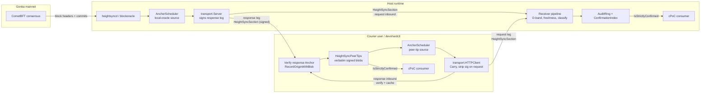
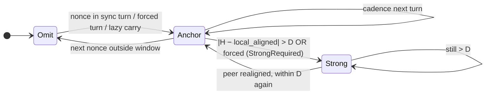

> 🔄 **Авто-синхронизация:** из [Discussion #1206](https://github.com/gonka-ai/gonka/discussions/1206) каждые 6 часов. 

# `devshard improvement` Height-sync protocol

**Автор:** [@alexanderkuprin](https://github.com/alexanderkuprin) · **Категория:** :bulb: Proposals · **Создано:** 2026-05-20 04:18 UTC · **Обновлено:** 2026-05-20 04:18 UTC

---

## 📝 Описание

# Height-sync protocol

User ↔ host envelopes carry an **optional `HeightSyncSection`** that attests to a mainnet `(height, block_hash)` pair. This section is the sole input to cross-host time alignment, timeout decisions, and the `IsStrictlyConfirmed(h)` predicate that downstream protocols (cPoC, finalization) gate verdicts on.
`block_hash` is a source of determenistic randomness that is unknown in advance, used by [`VALIDATION_PROTOCOL_PROPOSAL.md`](./VALIDATION_PROTOCOL_PROPOSAL.md)

This document is the **canonical, single-version** spec. The in-tree implementation matches this document; the test catalog ([`height-sync-tests.md`](https://github.com/alexanderkuprin/gonka/blob/devshard-testenv/devshard/docs/height-sync-tests.md)) lists what is already proven and what is planned.

Related docs:
[`height-sync-tests.md`](https://github.com/alexanderkuprin/gonka/blob/devshard-testenv/devshard/docs/height-sync-tests.md) (test catalog — implemented and planned),
[`CPOC_PROTOCOL.md`](./CPOC_PROTOCOL.md),
[`FINALIZATION_COLLECTOR_PROTOCOL_PROPOSAL.md`](./FINALIZATION_COLLECTOR_PROTOCOL_PROPOSAL.md),
[`VALIDATION_PROTOCOL_PROPOSAL.md`](./VALIDATION_PROTOCOL_PROPOSAL.md).

---

## Table of contents

1. [Summary](#1-summary)
2. [Problem](#2-problem)
3. [High-level overview of protocol](#3-high-level-overview-of-protocol)
4. [Goals](#4-goals)
5. [Glossary](#5-glossary)
6. [Architecture overview](#6-architecture-overview)
7. [Wire format](#7-wire-format)
8. [Sync modes (Omit / Anchor / Strong)](#8-sync-modes-omit--anchor--strong)
9. [Cadence (sync turns, `K`, `slots_num`, forced turns)](#9-cadence)
10. [Producer rules](#10-producer-rules)
11. [Receiver pipeline](#11-receiver-pipeline)
12. [Trust model and signatures](#12-trust-model-and-signatures)
13. [Carry-forward, provenance, attribution](#13-carry-forward-provenance-attribution)
14. [Confirmation API (`IsStrictlyConfirmed`)](#14-confirmation-api)
15. [cPoC integration — full API](#15-cpoc-integration-api)
16. [Attack model and mitigations](#16-attack-model)
17. [Defaults and configuration](#17-defaults-and-configuration)
18. [Status and milestones](#18-status-and-milestones)

---

## 1. Summary

User–host inference traffic carries a **two-section HTTP body**:

1. **`HeightSyncSection`** — optional mainnet attestation: a signed
   `(mainnet_height, mainnet_block_hash)` pair, plus framing and
   provenance metadata.
2. **`message_body`** — the application payload (opaque to height
   sync).

Section 1 is **emitted only when needed**:

- **Sync turn** — the standard cadence: every `K` nonces, a window of
  `slots_num` consecutive nonces carries Anchor; in between, Omit.
- **Forced sync turn** — `MsgForceHeightSyncTurn` opens a
  `slots_num`-wide Anchor span at any nonce (cPoC dispute open,
  operator force).
- **`|Δ| > D`** — when the sender's claimed height differs from the
  receiver's aligned height by more than `D`, the sender MUST use
  **Strong** (`LightBlock` + `VerifyCommit`); otherwise the receiver
  rejects.

Hosts sign **response-leg** Anchors with their secp256k1 signer key; courier users carry these signed blobs forward, verifying on ingest and using them as on-demand exculpation proof. Request-leg Anchors are trusted by hosts (no inline signature) — the user proves provenance later if disputed.

A single **`IsStrictlyConfirmed(h)`** predicate exposes a discrete `{confirmed, pending, stale}` answer to downstream consumers.

---

## 2. Problem

At devshard we need source of mainnet height and randomness, that is unknowm in advance but is determenistic to make all hosts and user to aggree.

Each host has it's own latest `(height, block_hash)` oracle (inference chain grpc), and the prove by inference chain validators signatures. But hosts should aggree that any `height` provided to protocol is really latest. So there should be height sync protocol provided in this doc.

## 3. High-level overview of protocol

As devshard is designed for high throughput we aim to minimize extra data transferred in messages and minimize checks of minnet signatures. Also we are minimizing gossipping that should happen only on disputes and settlement to minimize traffic (as one host could be in a lot of devshard's)

So main design decitions are made:

- Height synchronization happens not on every nonce but only in specialized windows, where we add to request/response only `(height, block_hash)` and originator's (host that is responding to request) signature, to proove origin of this data for possible disputes. User is carrying forward `(height, block_hash)` at next requests to propogate this data to other hosts.
- We trust heights in the future without additional mainnet proove if the height is close to the one we know is current. If there is a large disagreement between hosts on height (`height_in_the_future - known_height = |Δ| > D`) we use the full data from mainnet (block hash and validators signatures) to validate the height
- If we find that any earlier provided by any host `height` doesn't match the oracle `block_hash` we start the dispute

As the result we provide API at devshardd and devshardctl that gives latest height, block hash and the knowledge if majority of devshard network participants agree on this.

---

## 4. Goals

1. **Cheap periodic alignment** — Anchor (no `LightBlock`) on a
   sync-turn schedule keeps every host's view of mainnet time within
   a bounded window without per-message proof overhead.
2. **Strong escalation on disagreement** — once `|Δ| > D` or
   finalization requires it, validator-quorum-bound proof
   (`LightBlock`) is mandatory.
3. **Provenance and attribution** — every cached `(H, hash)` is
   traceable to the originating host signature; carriers cannot be
   blamed for forwarding a malicious host's signed claim, and
   carriers that strip provenance become the cryptographic source.
4. **Replay resistance** — freshness budget `F` on originator
   timestamp + per-recipient last-propagated bookkeeping prevents a
   carrier from re-using stale or already-delivered tips.
5. **Confirmation contract for downstream consumers** — discrete
   `IsStrictlyConfirmed(h) ∈ {confirmed, pending, stale}` predicate
   so cPoC / finalization do not invent their own quorum logic.
6. **Courier-only deployment** — users with no mainnet follower of
   their own can still carry signed host tips between hosts in the
   round-robin and reach `(C-quorum)` confirmation.

---

## 5. Glossary

| Term | Meaning |
| ---- | ------- |
| **`HeightSyncSection`** | Wire-level header attached to every inference envelope; absent in Omit mode. |
| **Anchor** | `proof_type = "height-anchor-v1"`; carries `(H, hash)` without a `LightBlock`. Light path. |
| **Strong** | `proof_type = "cometbft-light-block-v1"`; carries `LightBlock` bytes; verified against pinned validator set with `> 2/3` voting power. |
| **Omit** | No `HeightSyncSection`. |
| **`H`** | Mainnet height; uint64. |
| **`hash`** | Canonical `BlockID.Hash` for block `H`. |
| **`K`** | Distance (in nonces) between sync-turn windows. Constraint: `K ≥ slots_num`. |
| **`slots_num`** | Width of a sync-turn window in nonces (equals escrow host slots). |
| **`D`** | Strong-escalation band; `\|H_peer − H_local_aligned\| > D` ⇒ Strong required. Default `2`. |
| **`F`** | Originator freshness budget. Default `60 s`. |
| **`W_conf`** | Confirmation-index height window. Default `max(256, ⌈F / block_time⌉)`. |
| **`Q`** | `(C-quorum)` threshold. Default `ceil(2/3 × N_hosts)`. |
| **Originator** | The host whose **own oracle** first observed `(H, hash)`. Identified by `OriginatorSenderID` on the wire. |
| **Carrier** | Any sender that forwards a section it did not originate (typically the user). Identified by the session signature. |
| **`local_aligned`** | The receiver's view of mainnet height (its own follower, or its peer-tip cache for courier users). |
| **`IsStrictlyConfirmed(h)`** | `{confirmed, pending, stale}` predicate consumed by cPoC. |

---

## 6. Architecture overview



Key invariants:

- **Each host has its own mainnet follower** (`heightsyncd`/blockoracle);
  this is the canonical source of `local_aligned`.
- **The user has no follower** (courier mode); it derives
  `local_aligned` from the verified peer-tip cache populated by
  signed host responses.
- **`HeightSyncSection` is the only mainnet-related wire surface** on
  inference envelopes; the receiver pipeline is single-entry.

---

## 7. Wire format

`HeightSyncSection` is carried as protobuf field on the inference
envelope and JSON-mirrored for tooling. Field numbers are stable.

| # | Name | Type | Required when | Notes |
|---|------|------|---------------|-------|
| 1 | `proof_type` | `string` | Anchor / Strong | `"height-anchor-v1"` (Anchor) or `"cometbft-light-block-v1"` (Strong). |
| 2 | `mainnet_height` | `int64` | Anchor / Strong | Block height `H`. MUST NOT be set in Omit. |
| 3 | `mainnet_block_hash_hex` | `string` (hex) | Anchor / Strong | Canonical `BlockID.Hash` for `H`. |
| 4 | `timestamp_unix_ms` | `int64` | always | When the **carrier** built this section. |
| 5 | `direction` | `string` | always | `"request"` or `"response"`. |
| 6 | `originator_sender_id` | `string` | carry-forward | The host that first observed `(H, hash)` from its own oracle. Carrier MUST preserve. |
| 7 | `originator_timestamp_unix_ms` | `int64` | carry-forward | The originator's observation timestamp. Drives freshness gate `F`. |
| 8 | `sender_signature` | `bytes` | **response leg only** | secp256k1 signature over canonical bytes of fields 1–7 + domain `"heightsync.origin.v1"`. Empty on request leg. |
| 9 | `light_block` | `bytes` | Strong only | Serialized `LightBlock`-equivalent (`blockoracle.Header` with `Commit.Signatures`). |
| 10 | `tip_stale_after_ms` | `int64` | optional (Anchor) | **Advisory only** — not origin-signed. Milliseconds since the producer's block oracle last ingested a **new** header. Set when cadence wanted Anchor but the feed is quiet (long block time, `StaleAfter` exceeded) while a cached `(H, hash)` is still available. Absent when the tip is fresh or on courier carry-forward re-emits. Receivers MUST NOT treat this field as part of the cryptographic attestation; use freshness gate `F` on originator timestamps and `(C-quorum)` / `IsStrictlyConfirmed` for liveness. |

Notes:

- **Degraded Anchor (quiet feed).** When the local oracle has not
  received a new block within `StaleAfter` but `Latest()` still
  returns a cached header, hosts emit a normal Anchor (fields 1–8) plus
  field 10. This avoids sync-turn **response** Omit during long
  inter-block gaps; consensus across hosts still corrects a minority
  with an outdated tip. **Omit** remains mandatory when there is **no**
  cached tip (feed never started), `Latest()` fails (feed unavailable),
  or the courier peer-tip cache is empty.
- **Direction-bound signatures.** Field 8 is set by hosts on responses
  only. `Carry()` clears field 8 before sending on the request leg;
  inbound request validation does not require an inline signature.
- **Canonical signing input.** `CanonicalOriginBytes(sec)` =
  `"heightsync.origin.v1" || proto.Marshal(fields 1..7)`. Field 8
  is **not** part of the signing input.
- **Wire-level reservation.** `origin_attestation` (embedded
  originator blob) is reserved for future inline-embed deployments;
  current protocol uses the **asymmetric** model (response signed,
  request trusted, on-demand exculpation).

JSON mirror:

```json
{
  "height_sync": {
    "proof_type": "height-anchor-v1",
    "mainnet_height": 42,
    "mainnet_block_hash_hex": "abc...",
    "timestamp_unix_ms": 1700000000000,
    "direction": "response",
    "originator_sender_id": "gonka1host...",
    "originator_timestamp_unix_ms": 1700000000000,
    "sender_signature": "base64...",
    "light_block": "base64...",
    "tip_stale_after_ms": 12000
  }
}
```

(`tip_stale_after_ms` omitted when the cached tip is fresh.)

---

## 8. Sync modes (Omit / Anchor / Strong)



| Mode | Section 1 fields 2/3 | Field 9 (`light_block`) | When |
| ---- | -------------------- | ----------------------- | ---- |
| **Omit** | absent | absent | Between sync turns; courier peer-tip cache cold; host feed unavailable or **no cached tip**. |
| **Anchor** | present | empty | Inside a sync-turn window (cadence / initial / forced) or lazy carry-forward in courier mode. |
| **Anchor (degraded)** | present + field 10 | empty | Same as Anchor when cadence applies but the host oracle is **quiet** (`StaleAfter` since last block) and a cached tip exists — see field 10. |
| **Strong** | present | non-empty (verified) | `\|Δ\| > D`, finalization-grade, or forced turn with `StrongRequired = true`. |

Periodic alignment uses **Anchor only**. Strong is **not** a default
cadence step — it is the disagreement / dispute path.

**Quiet feed vs dead feed (hosts):**

| Oracle state | Cached tip | Sync-turn response |
| ------------ | ---------- | ------------------ |
| Fresh (block within `StaleAfter`) | yes | Anchor (no field 10) |
| Quiet (no new block within `StaleAfter`) | yes | **Degraded Anchor** (`tip_stale_after_ms` > 0) |
| Quiet or fresh | no | Omit (`oracle_miss` when cadence required) |
| Unavailable (`Latest()` error, e.g. height-sync stopped) | — | Omit |

---

## 9. Cadence

### Sync-turn windows

For a session direction, on outgoing nonce `n`:

- **Initial sync turn:** `1 ≤ n ≤ slots_num` → Anchor (or Strong, see §10).
- **Periodic sync turns:** for every `i ≥ 1`, `i·K ≤ n ≤ i·K + slots_num − 1` → Anchor.
- All other nonces → **Omit**, unless a force directive or lazy carry-forward applies.

Constraint: `K ≥ slots_num` so windows never overlap.

```mermaid
gantt
    title Sync-turn cadence (K=8, slots_num=4)
    dateFormat X
    axisFormat %s
    section Cadence
    Initial sync turn (Anchor) :a1, 1, 4
    Omit                       :a2, 5, 7
    Periodic sync turn 1       :a3, 8, 11
    Omit                       :a4, 12, 15
    Periodic sync turn 2       :a5, 16, 19
```



### Forced sync turn

`MsgForceHeightSyncTurn(trigger_nonce, slots_num, reason,
strong_required?)` opens an `ActiveForcedTurn{start, end}` span:

- **Both directions** MUST emit Anchor for every envelope in
  `[start, end]`. Omit inside a forced turn is INVALID.
- `strong_required = true` upgrades the window to Strong.
- A second directive while a turn is active is **silently ignored**.
- A forced window that overlaps the next cadence window **swallows**
  it (no double-Anchor on boundary).
- After `n > end`, cadence resumes from the standard rule.

### Lazy carry-forward (courier deployments)

Outside any sync-turn window, the courier user MAY emit Anchor on a
request leg iff:

1. The peer-tip cache holds a fresh originator section
   (`MaxFresh(now, F)` returns non-nil).
2. `cached_max_height > last_propagated[recipient]`.

The receiver classifies this as **`VALID_LAZY_ANCHOR`** (audit tag
`lazy`); it does **not** open a sync-turn obligation.

---

## 10. Producer rules

### Hosts (have own oracle)

- On every outbound **response**: consult the local oracle; if a sync
  turn or forced turn applies, emit Anchor with
  `OriginatorSenderID = host_address`,
  `OriginatorTimestampMs = now`, and **sign** the section (field 8).
  If the oracle is quiet (no new block within `StaleAfter`) but a
  cached tip exists, still emit that Anchor and set
  `tip_stale_after_ms` to the age of the last ingested block (field 10
  is set **after** signing input fields 1–7). Omit only when there is
  no usable cached tip or `Latest()` fails.
- If `forced.StrongRequired` is set OR receiver's
  `peer_aligned_height` differs from local tip by `> D`: produce
  Strong by attaching the cached `LightBlock` for `H` (field 9).
- On inbound **requests**: do not sign anything; classify via the
  receiver pipeline (§11).

### Courier user (no own oracle)

- Maintain `HeightSyncPeerTips` keyed by `OriginatorSenderID`.
- Verify host responses on ingest (`VerifyOrigin`); on failure, drop
  the tip and increment `origin_sig_invalid_total`.
- On outbound **requests**: consult the scheduler; lazy carry only
  when the cache has a tip not yet propagated to the recipient. Clear
  field 8 (`sender_signature`) before sending.
- Producer never sets `OriginatorSenderID = user_address`; that field
  reflects the host that signed the cached blob.

---

## 11. Receiver pipeline

```mermaid
flowchart TD
    A[envelope arrives] --> B{HeightSyncSection<br/>present?}
    B -- no --> O{nonce in sync turn /<br/>active forced turn?}
    O -- yes --> O1[INVALID<br/>sync_turn_anchor_missing]
    O -- no --> O2[VALID_OMIT]
    B -- yes --> C{Anchor or Strong?}
    C -- Anchor --> D{\|H − local_aligned\| > D?}
    D -- yes --> D1[INVALID<br/>strong_required]
    D -- no --> E{carry-forward<br/>originator set?}
    E -- yes --> F{originator within F?}
    F -- no --> F1[INVALID<br/>stale_origin]
    F -- yes --> G[classify cadence / lazy<br/>by nonce vs sync turn]
    E -- no --> G
    C -- Strong --> H[StrongVerifier.VerifyLightBlock]
    H -- ok --> I[VALID_STRONG]
    H -- fail --> H1[INVALID<br/>strong_proof_invalid]
    G --> J{block H local AND<br/>hash matches?}
    J -- yes/match --> K[VALID_ANCHOR or<br/>VALID_LAZY_ANCHOR]
    J -- no/local-missing --> L[enqueue deferred check]
    J -- local AND mismatch --> M{originator present?}
    M -- yes --> M1[DISPUTE_ORIGINATOR]
    M -- no --> M2[DISPUTE_CARRIER]
```

Normative steps for a non-Omit envelope:

1. **Parse + framing** (proto / JSON).
2. **Forced-turn check first.** If `ActiveForcedTurn[start..end]` is
   set and `start ≤ nonce ≤ end`, the envelope MUST be Anchor (or
   Strong when `StrongRequired`). Omit ⇒ INVALID.
3. **`D` band.** If `proof_type == "height-anchor-v1"` and
   `|H − local_aligned| > D`: INVALID (`strong_required`).
4. **Strong path.** If `proof_type == "cometbft-light-block-v1"`: run
   `StrongVerifier.VerifyLightBlock` (chain id, header vs claims,
   `validators_hash`, optional epoch-bound Step 3b, `BlockID`,
   commit `> 2/3`); failure ⇒ INVALID (`strong_proof_invalid`).
5. **Originator presence and freshness.** If
   `OriginatorSenderID != ""`:
   - If `now_ms − OriginatorTimestampMs > F` ⇒ INVALID
     (`stale_origin`); audit trust = `TrustDisputeCarrier`.
   - Else continue.
6. **Cadence / lazy classification.**
   - Inside sync-turn (cadence / initial / forced): `VALID_ANCHOR`
     (tag `cadence`).
   - Outside sync-turn + originator present (courier): `VALID_LAZY_ANCHOR`
     (tag `lazy`).
   - Outside sync-turn + originator absent + Anchor: legacy host
     self-attestation; `VALID_ANCHOR`.
7. **Local oracle reconciliation.**
   - If block `H` is **local** and `hash` matches → confirmed
     immediately; feed `ConfirmationIndex`.
   - If `H` is **not yet local** → enqueue deferred check by
     `(originator, H, hash)`; do not advance `height_seen_max`.
   - If `H` is **local** and `hash` differs → `DISPUTE_ORIGINATOR`
     (originator metadata present) or `DISPUTE_CARRIER`
     (originator absent or signature failed); persist the offending
     signed blob.
8. **Audit + metrics.** Append `AnchorAttestation` (with `Tag`,
   `Trust`, `OriginatorSenderID`, `OriginSignedBlobAvailable`) to the
   per-peer ring; emit counters.
9. **Process `message_body`** if not INVALID.

### Result classes

| Class | Meaning |
| ----- | ------- |
| `VALID_OMIT` | No height attestation; framing OK. |
| `VALID_ANCHOR` | Anchor inside cadence / forced span; hash matched or deferred enqueued. |
| `VALID_LAZY_ANCHOR` | Anchor outside cadence (courier path); same audit semantics as VALID_ANCHOR, tag `lazy`. |
| `VALID_STRONG` | `LightBlock` verified against pinned set; may advance strong anchor state. |
| `VALID_STALE` | Cryptographically OK but recency rule fails (Strong-only). |
| `DEFERRED_FAIL` | Deferred check found hash mismatch ⇒ evidence vs originator. |
| `DISPUTE_ORIGINATOR` | Same-height / different-hash with verified originator. |
| `DISPUTE_CARRIER` | Same-height / different-hash without verified provenance. |
| `INVALID(reason)` | One of: `sync_turn_anchor_missing`, `stale_origin`, `strong_required`, `strong_proof_invalid`, `bad_framing`. |

---

## 12. Trust model and signatures

The protocol is **asymmetric**: responses are signed, requests are
trusted, exculpation is on-demand.

```mermaid
sequenceDiagram
    participant U as User (courier)
    participant H as Host A
    participant H2 as Host B
    U->>H: request (request leg, no sig)
    H->>U: response Anchor [signed by Host A]
    Note over U: VerifyOrigin OK<br/>RecordOriginWithBlob(host_A, H, blob, sig)
    U->>H2: request Anchor (carry-forward, no inline sig)
    Note over H2: trusts carrier;<br/>freshness gate F applies
    Note over H2: later, follower advances<br/>compares hash to canonical
    H2-->>U: DEFERRED_FAIL? open dispute vs user
    U->>U: HeightSyncEvidenceFor(host_A, H) → blob + sig
    U-->>H2: signed_blob proves originator = Host A<br/>⇒ DISPUTE_ORIGINATOR vs Host A
```

### Response leg (host → user)

1. Host fills `OriginatorSenderID`, `OriginatorTimestampMs`, builds
   `CanonicalOriginBytes` (fields 1–7 + domain `heightsync.origin.v1`).
2. Signs with the host's secp256k1 key, sets field 8.
3. User verifies field 8 on ingest. Fail ⇒ drop, no cache, no
   propagation; `origin_sig_invalid_total` increments.
4. On success: `RecordOriginWithBlob(originator, sec, blob, sig)`.

### Request leg (user → host)

1. Carry copies originator fields (6, 7) from the cached blob.
2. `Carry()` strips field 8 before sending.
3. Host accepts the section subject to receiver pipeline (§11). No
   inline signature is required or verified.

### Exculpation

If a host later opens a dispute against the user-carrier, the user calls `HTTPClient.HeightSyncEvidenceFor(originator, H)` to produce the cached `(blob, sig)`. A dispute verifier re-runs `VerifyOrigin`; success ⇒ blame shifts to the originating host (`DISPUTE_ORIGINATOR`); failure ⇒ blame stays on the carrier (`DISPUTE_CARRIER`).

### Strong proof

When Strong is on the wire (`light_block` non-empty), validation is **cryptographic** against the pinned validator set:

1. Decode bytes as `LightBlock`-equivalent (`blockoracle.Header`).
2. Check `chain_id`, `height`, `block_hash` against claims.
3. Verify `validators_hash` matches Merkle root of the pinned set.
4. (Optional) Step 3b — verify against per-epoch participant set.
5. Verify `BlockID == hdr.BlockID`.
6. Run `VerifyCommit`: every commit signature ecrecovers to a pinned
   validator, no duplicates, accumulated power strictly `> 2/3` of
   total.
7. (Optional) Recency: `h ≥ local_tip − max_lag_blocks` else
   `VALID_STALE`.

---

## 13. Carry-forward, provenance, attribution

### Rules

- **Originator fields are immutable across hops.** Carrier MUST NOT overwrite `OriginatorSenderID` or `OriginatorTimestampMs`.
- **`D` bound on carry-forward.** A carry-forward Anchor with `|H − local_aligned| > D` is INVALID; carrier MUST escalate to Strong instead. (This is a stricter form of `strong_required`.)
- **Sender signature stripped on request.** The user's outbound request never carries field 8. The host trusts the request based on freshness + cadence rules; cryptographic proof lives in the user's cached blob.
- **Provenance-less carry = carrier is the source.** If a user forwards a section with empty originator fields, the carrier becomes the cryptographic signer of the claim and absorbs any dispute (`DISPUTE_CARRIER`).

### `last_propagated` discipline

`HeightSyncPeerTips.ShouldPropagateTo(recipient, h)` returns true iff
`h > last_propagated[recipient]`. On a successful send,
`MarkPropagated(recipient, h)` advances the high-water mark.
Reaching a quorum at a late host requires a strictly increasing
**height ladder** (production-faithful) — not three lazy carries at
the same `H`.

---

## 14. Confirmation API

### Contract

```go
// devshard/heightsync/confirmation.go

type ConfirmState int
const (
    ConfirmPending   ConfirmState = iota
    ConfirmConfirmed
    ConfirmStale
)

type ConfirmationView interface {
    IsStrictlyConfirmed(h uint64) ConfirmState
}
```

Semantics:

- **`confirmed`** — `h` has cleared the configured confirmation rule.
  Downstream protocols MAY treat `(h, hash)` as authoritative.
- **`pending`** — height-sync has data for `h` but has not yet cleared
  the rule. Downstream MUST NOT commit adversarial verdicts; cPoC
  returns `Inconclusive` (`C6`).
- **`stale`** — `h` cannot be evaluated because the oracle is stale /
  disconnected. Downstream treats verdicts as `Inconclusive` until
  recovery.

**Monotonicity:** once `confirmed`, a height stays `confirmed`.
`pending → confirmed` is the only forward transition.

### Confirmation rules

Configured at deployment time:

| Rule | Predicate |
| ---- | --------- |
| `(C-quorum)` | `≥ Q` distinct originators from the roster have attested heights `≥ h`, all within `F`, all in `[tip − W_conf, tip]`. |
| `(C-strong)` | Receiver has at least one **verified `LightBlock`** for height `≥ h`. |
| `(C-hybrid)` | Either of the above clears. |

PoC deployments without Strong run **`(C-quorum)`**. Production-class
deployments SHOULD select **`(C-hybrid)`** once Strong is enabled.

### Confirmation memory and pruning

| Parameter | Role | Default |
| --------- | ---- | ------- |
| `F` | Freshness; ineligible after `now − observed_at > F` | `60 s` |
| `W_conf` | Index window: only heights in `[tip − W_conf, tip]` count | `max(256, ⌈F / block_time⌉)` |
| `Q` | Quorum threshold (C-quorum) | `ceil(2/3 × N_hosts)` |

- **On ingest:** upsert per-originator entry if height is in window.
- **On tip advance:** compact (`max_height < tip − W_conf` or
  `observed_at` past `F`).
- **Monotonicity guard:** retain a small `confirmed_heights` set so
  pruning never demotes a confirmed height.

### Per-`V` view, not global

`IsStrictlyConfirmed` is computed against the **caller's own** audit
ring and clock. Two verifiers may transiently disagree (`pending` vs
`confirmed`); cPoC's quorum-based slashing tolerates this.

---

## 15. cPoC integration — full API

The following Go APIs are the **stable surface** that cPoC and
finalization consume. Implementation paths in parentheses.

### 15.1 Discrete confirmation predicate

```go
// On the user side (courier):
func (c *transport.HTTPClient) ConfirmationView() heightsync.ConfirmationView
// On the host side (own oracle):
func (s *transport.Server) ConfirmationView() heightsync.ConfirmationView
```

Both expose `ConfirmationView.IsStrictlyConfirmed(h uint64) ConfirmState`.
cPoC §C6 / §C14 / §Verdict step 5 call this directly.

**Usage example (cPoC verdict):**

```go
view := server.ConfirmationView()
switch view.IsStrictlyConfirmed(h) {
case heightsync.ConfirmConfirmed:
    // commit verdict
case heightsync.ConfirmPending:
    return InconclusivePendingHeight(h)
case heightsync.ConfirmStale:
    return InconclusiveStaleOracle()
}
```

### 15.2 Observed height (courier heartbeat)

```go
func (c *transport.HTTPClient) ObservedHeightNow() (uint64, bool)
```

Returns `(h, true)` where `h` is the highest fresh tip in the
courier peer-tip cache; `(0, false)` when no fresh tip exists or
height sync is not configured. Used by cPoC C14 heartbeats — a
`false` return means "Inconclusive — no fresh height".

### 15.3 Exculpation evidence (dispute layer)

```go
// User side: produce the originator's signed blob for (originator, h).
func (c *transport.HTTPClient) HeightSyncEvidenceFor(
    originator string, h int64,
) (blob, sig []byte, ok bool)
```

Returned by the courier cache (`HeightSyncPeerTips.OriginSignedBlobFor`).
Verifiable with `heightsync.VerifyOriginDetached(verifier, sec, blob, sig)`
without reaching the user.

### 15.4 Strong-grade evidence (Strong mode)

```go
// Host side: return cached LightBlock for h, if available.
func (s *transport.Server) LightBlockFor(h int64) (proof []byte, ok bool)
```

When the receiver's follower has advanced past a disputed `H`, the
dispute packet may carry both halves:

- Originator's signed blob from `HeightSyncEvidenceFor` (blame).
- Receiver's `LightBlock` from `LightBlockFor` (canonical pair).

A mock dispute verifier returns `DISPUTE_ORIGINATOR` when both pass.

### 15.5 Cold-start seed (optional)

```go
// Server option:
transport.WithHeightSyncSeedRPC(true)
// Client call:
func (c *transport.HTTPClient) SeedHeightSync(ctx context.Context) (uint64, bool, error)
```

Opt-in `POST /sessions/:id/height-sync`: the host returns a forced
Anchor (originator-signed). The courier verifies + caches it before
issuing the first inference — useful for short-lived sessions where
the first inference is not in a sync turn.

### 15.6 Force a sync turn

```go
// Operator / dispute / cPoC trigger:
state.SendMsgForceHeightSyncTurn(triggerNonce, slotsNum, reason, strongRequired)
```

Opens an `ActiveForcedTurn` in the next diff; every envelope in
`[trigger, trigger + slots_num − 1]` MUST be Anchor (or Strong when
`strongRequired = true`).

### 15.7 Audit and dispute consumers

```go
type AuditRing interface {
    List(peerID string) []AnchorAttestation
    ListPeers() []string
    ConfirmationView() ConfirmationView
}

func (c *transport.HTTPClient) HeightSyncAuditRing() *heightsync.AuditRing
func (s *transport.Server)    HeightSyncAuditRing() *heightsync.AuditRing
```

Used by dispute / finalization consumers that need verbatim
attestations and per-peer history.

---

## 16. Attack model

Each row maps an adversary action to the protocol's defence and to
the test scenario that proves it (full catalog in
[`height-sync-tests.md`](https://github.com/alexanderkuprin/gonka/blob/devshard-testenv/devshard/docs/height-sync-tests.md)).

| # | Adversary action | Defence | Proven by |
| - | ---------------- | ------- | --------- |
| 1 | Host emits wrong `(H, hash)` and signs it | `(C-quorum)` rejects single bad vote; deferred check eventually triggers DEFERRED_FAIL; `DISPUTE_ORIGINATOR` with stored signed blob | `TestHeightSyncAnchor_E2E_MixedHeights_Confirmed`, `TestHeightSyncAnchor_E2E_CheatingTrailStoresBogusUserHash`, `TestHeightSyncAnchor_E2E_CarrierExculpation`; planned: `TestHeightSyncStrong_E2E_DeferredFail_StrongEvidence` |
| 2 | Carrier replays a stale originator section | Freshness gate `F` rejects with `stale_origin`; carrier flagged `TrustDisputeCarrier` | `TestHeightSyncAnchor_E2E_StaleOriginRejected`, `TestHeightSyncAnchor_E2E_HeldOriginatorReplayRejected` |
| 3 | Carrier strips originator fields on carry-forward | Carrier becomes the cryptographic signer; `DISPUTE_CARRIER` on mismatch; sync-turn empty-originator audit dispute sentinel | Existing audit-ring tests; `TestHeightSyncAnchor_E2E_ForcedSyncTurn_HostResponsesAnchorEvenIfUserOmits` |
| 4 | Carrier substitutes hash | Audit verbatim; quorum cannot reach `confirmed`; eventually DEFERRED_FAIL | `TestHeightSyncAnchor_E2E_CheatingTrailStoresBogusUserHash` |
| 5 | Host returns invalid `sender_signature` | User drops tip; `origin_sig_invalid_total` increments; no cache; reputation/liveness handles persistent offenders | `TestHeightSyncAnchor_E2E_ResponseOriginSignatureInvalidDropped`, `TestClient_ResponseAnchor_DropsOnInvalidSig` |
| 6 | Sender claims `(H, hash)` `\|Δ\| > D` ahead with Anchor (no Strong) | `INVALID(strong_required)`; carrier cannot escape via originator metadata | Planned: `TestClassify_StrongRequiredOutsideD`, S1, S8 |
| 7 | Tampered `LightBlock` (signatures, validators_hash, BlockID) | Step 2/3/5/6 of CometBFT verification rejects | Planned: `TestVerifyLightBlock_*`, S4 |
| 8 | Validator-set substitution (wrong epoch) | Optional Step 3b verifies against epoch participants | Planned: S9 |
| 9 | Mainnet feed **unavailable** mid-session (`Latest()` fails) | Scheduler emits Omit on sync turn; `IsStrictlyConfirmed → stale`; no crashes; cPoC returns `Inconclusive` | `TestHeightSyncAnchor_E2E_HeightSyncFeedStopped_*`, `TestHeightSyncAnchor_E2E_StaleOracle_Inconclusive` |
| 13 | Long inter-block time (feed quiet, cached tip still valid) | Host emits **degraded Anchor** with `tip_stale_after_ms`; courier may still ingest verified response tips; `(C-quorum)` reconciles height across hosts | `TestAnchorScheduler_StaleFeedEmitsDegradedAnchorInSyncTurn`, `TestDecide_LogStaleSyncTurn`, container `TestContainerE2E_HeightSync_Cadence` (testenv `MOCKDAPI_STALE_AFTER` ≥ block cadence) |
| 10 | Host equivocates across sessions (`(H, hash_A)` then `(H, hash_B)`) | Per-`V` audit ring + dispute layer cross-session check | Audit-ring tests; full cross-session detection deferred to dispute plan |
| 11 | User omits Anchor inside a forced sync turn | Hosts MUST still emit Anchor on responses; missing user Anchor recorded as `force_request_anchor_missing` sentinel for dispute | `TestHeightSyncAnchor_E2E_ForcedSyncTurn_HostResponsesAnchorEvenIfUserOmits` |
| 12 | Replay an old verified `LightBlock` | Recency gate `local_tip − max_lag_blocks` → `VALID_STALE`; never advances aligned height | Planned (Strong recency) |

**Out-of-scope adversaries:**

- An adversary who controls **`> 2/3`** of mainnet validators —
  outside this protocol's defence; same as any L1 consensus
  assumption.
- An adversary who poisons the host's local block oracle — block
  oracle has its own pinned validator-set verifier
  (`blockoracle/verifier`); height sync does not re-validate.

---

## 17. Defaults and configuration

| Parameter | Default | Configurable via |
| --------- | ------- | ---------------- |
| `K` | `8` | `AnchorScheduler` constructor (`NewAnchorSchedulerFromOracle(K, slots, src)`) |
| `slots_num` | `4` (testenv) / `slots_num = escrow.HostSlots` (production) | same |
| `D` | `2` | `StrongPolicy.D` (planned) |
| `F` | `60 s` | `HeightSyncPeerTips.Freshness`, `ConfirmationConfig.Freshness` |
| `W_conf` | `256` heights | `ConfirmationConfig.WindowHeights` |
| `Q` | `ceil(2/3 × N_hosts)` | `ConfirmationConfig.Quorum` (override; defaults from roster size) |
| Audit-ring capacity | `1024` per peer | `NewAuditRing(capacity)` |
| Header-cache window (Strong) | `64` heights | `BlockOracleStrongSource.K` (planned) |
| Strong recency | off (`max_lag_blocks = 0`) | follow-on hardening |
| Confirmation rule | `(C-quorum)` | `ConfirmationConfig.Rule` (`Quorum`/`Strong`/`Hybrid`) |
| `StaleAfter` (block oracle client) | `10 s` client default; testenv: `block_time + block_interval_delta + 1s` (floor `10s`) | `MOCKDAPI_STALE_AFTER` env (compose / devshardd-testenv) |

---

## 18. Status and milestones

| Milestone | Status | Notes |
| --------- | ------ | ----- |
| Cadence + Anchor + audit + forced turn | ✅ | v1 PoC; container parity Phase A–C green. |
| Courier mode + `(C-quorum)` + lazy carry + freshness gate | ✅ | v2; in-process e2e green (E1–E11). |
| Asymmetric response signatures + exculpation API | ✅ | Step 8 (v2.1); in-process e2e green (E9, E10). |
| Strong mode (`LightBlock` + `VerifyCommit` + `D` band + `(C-strong)` / `(C-hybrid)`) | ⏳ | Tests catalogued in [`height-sync-tests.md`](https://github.com/alexanderkuprin/gonka/blob/devshard-testenv/devshard/docs/height-sync-tests.md) §6 (S1–S12). |
| Container tests parity | ⏳ | follow-on. |
| On-chain `MsgHeightSyncEvidence` + slashing tx | ⏸ | dispute / cPoC owns. |

---

## Reading order for contributors

1. §6 — architecture diagram. Build a mental model of the host producer (own oracle, signs response leg) and the courier user (peer-tip cache, request-leg carrier) feeding a single receiver pipeline.
2. §8 — the three sync modes and the state diagram.
3. §11 — the receiver pipeline flowchart; this is the load-bearing normative section.
4. §12 — asymmetric signing model.
5. §14 + §15 — what cPoC actually consumes.
6. [`height-sync-tests.md`](../height-sync-tests.md) — every behaviour above is bound to at least one named test.

