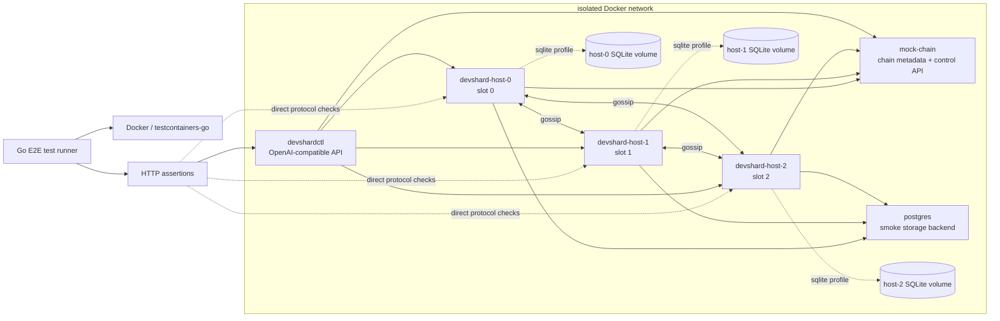

> 🔄 **Авто-синхронизация:** из [Discussion #1334](https://github.com/gonka-ai/gonka/discussions/1334) каждые 6 часов. 

# Devshard E2E Test Automation Proposal

**Автор:** [@aikuznetsov](https://github.com/aikuznetsov) · **Категория:** :bulb: Proposals · **Создано:** 2026-06-10 19:23 UTC · **Обновлено:** 2026-06-12 13:36 UTC

---

## 📝 Описание

## Goal

Build a real integration test layer for devshard that runs from Go tests but
validates the system across Docker containers, real HTTP networking, real
process boundaries, and real storage.

This suite should complement the existing unit, package, and `httptest` tests.
Those tests remain the fast correctness layer. The E2E suite verifies that the
same protocol works when the pieces are started, wired, restarted, and failed
like real services.

## Scope

The test runner is Go. The runtime is Docker.

The suite should not depend on a live Cosmos chain, Testermint, or
`decentralized-api`. Chain-facing metadata is served by a local mock service.
Inference and validation use deterministic stub engines unless a scenario
explicitly opts into a different backend.

Out of scope for the first version:

- production observability stack validation
- long-running performance or soak testing
- live chain settlement submission
- real ML model execution
- full versiond governance flow

Those can be added later as separate profiles once the core protocol E2E layer
is stable.

## Test Tools And Frameworks

The first E2E implementation should keep the toolchain small and Go-native.

Recommended tools:

| Area | Tool | Role |
|---|---|---|
| Test runner | Go `testing` | Owns scenario execution, assertions, setup, teardown, and CI integration. |
| Containers | `testcontainers-go` | Starts Docker networks, containers, exposed ports, volumes, and readiness checks from Go. |
| Assertions | `stretchr/testify` | Keeps E2E checks readable and consistent with existing devshard tests. |
| HTTP client | Go `net/http` plus devshard clients | Drives `devshardctl`, host transport routes, mock-chain controls, and diagnostic endpoints. |
| JSON handling | Standard `encoding/json` or existing devshard JSON helpers | Parses OpenAI-compatible responses, control responses, and settlement payloads. |
| Docker images | Explicit `make` targets | Builds images before tests run; individual tests select prebuilt images and fail fast if missing. |
| Database | Testcontainers Postgres module | Runs the smoke storage backend and deeper recovery scenarios. |
| Logs | Docker/testcontainers log capture | Collects container logs on test failure for diagnosis. |

Tools to avoid in the first version:

- Python scenario runners: Go keeps the scenarios close to devshard types,
  signing helpers, storage helpers, and existing assertions. Adding Python
  would create a second test runtime before the E2E contract is stable.
- Docker Compose as the primary test orchestrator: `testcontainers-go` gives
  each Go test direct control over networks, containers, ports, logs, restarts,
  and cleanup. Compose can still be useful later for manual reproduction.
- live Cosmos chain or Testermint: the first suite should isolate devshard
  protocol and transport behavior from chain startup, block production,
  governance, and unrelated node failures. `mock-chain` covers the bridge
  contract needed by devshard.
- real ML model execution: deterministic stub inference keeps tests fast,
  reproducible, and focused on protocol behavior rather than GPU/model
  availability or generation quality.
- browser/UI automation: devshard E2E validates HTTP APIs and protocol state.
  Browser automation would add slow UI concerns that are not part of this
  proposal.

## Test Environment Structure

Each test starts an isolated Docker network. The Go test process stays outside
the network and controls the environment through Docker APIs and mapped service
ports.

The default smoke environment should spin up:

- one `mock-chain` container
- three `devshard-host-N` containers
- one `devshardctl` container
- one `postgres` container

Storage and fault scenarios add containers or volumes as needed:

- persistent SQLite volumes for restart tests
- optional per-service control endpoints for deterministic fault injection



Container inventory:

| Container | Required | Count | Purpose |
|---|---:|---:|---|
| `mock-chain` | yes | 1 | Serves escrow, participant, epoch, version, and warm-key metadata. Provides dev-only control APIs for metadata faults. |
| `devshard-host-N` | yes | 3 by default | Runs one real devshard participant per slot with transport, gossip, storage, signing, and stub engines. |
| `devshardctl` | yes for smoke | 1 | Exposes the OpenAI-compatible user API and drives the normal user-facing path. |
| `postgres` | yes | 1 | Provides the default smoke storage backend and production-like recovery coverage. |
| SQLite volumes | no | 1 per host | Preserve host-local state across container restarts in SQLite recovery scenarios. |

The first implementation should standardize on a three-host group because many
protocol behaviors need a majority-like shape: executor rotation, timeout
votes, signature accumulation, and gossip convergence. The harness can expose
`Hosts: N` later for stress or edge-case tests.

## Runtime Services

Each E2E environment starts an isolated Docker network and a small set of
services.

### `mock-chain`

`mock-chain` is a local metadata service that implements the subset of mainnet
bridge behavior needed by devshard.

The first implementation should match the current REST bridge shape exactly.
That keeps E2E focused on validating the bridge contract devshard already uses
instead of adding a second mock-only API. A cleaner internal control API can be
added alongside the REST-compatible endpoints later, but protocol setup and
recovery should continue to exercise the same paths as production code.

It serves deterministic local config for:

- escrow ID
- escrow creator address
- escrow balance
- epoch ID
- app hash
- host slot assignments
- host inference URLs
- token price
- validation threshold
- warm key grants
- approved devshard versions, when a version scenario needs them

It should also expose a dev-only control API for test scenarios:

- advance epoch
- change approved versions
- change host metadata
- add or remove warm key grants
- inject response delays
- inject bridge errors

### `devshard-host-N`

Each host container runs one participant. The process should use the real
devshard host, transport, signing, storage, gossip, and state machine code.

Configurable inputs:

- escrow ID
- host signer key
- user address
- slot assignment
- route prefix
- peer host URLs
- storage backend
- mock-chain URL
- stub inference behavior
- stub validation behavior

The host should expose the standard devshard transport routes, mounted under
either the legacy route prefix or a versioned prefix:

```text
/v1/devshard/*
/devshard/<version>/*
```

### `devshardctl`

The suite should include scenarios that drive requests through the
OpenAI-compatible `devshardctl` surface. This validates the user-facing path:

```text
client -> devshardctl -> devshard transport clients -> host containers
```

Some lower-level scenarios can talk directly to host transport endpoints when
that makes the assertion clearer, but the smoke suite should use
`devshardctl`.

### `postgres`

Postgres is part of the smoke environment and should be the default storage
backend for CI smoke tests. SQLite remains useful for local restart tests and
single-host persistence edge cases.

Storage scenarios should cover:

- SQLite host restart
- Postgres host restart
- all-host restart
- session version conflict
- session epoch conflict where applicable

## Test Binaries

The E2E suite needs runnable commands that are small wrappers around existing
devshard packages.

Recommended commands:

```text
devshard/cmd/devshardd/
  main.go

devshard/cmd/mock-chain/
  main.go
```

### `devshardd`

`devshardd` runs one host participant.

For the first E2E implementation, `devshardd` should be an E2E-only command.
It should not be treated as a production binary yet. This keeps the first
iteration focused on integration validation, while leaving room to harden and
promote the command later if it becomes the right production shape.

It should wire:

- bridge client
- state machine
- host
- transport server
- storage
- gossip peers
- inference engine
- validation engine
- readiness endpoint
- dev-only control endpoint when explicitly enabled

For E2E, `devshardd` can start with stub inference and validation engines.
The important point is that the protocol runtime itself is real.

### `mock-chain`

`mock-chain` serves local metadata and deterministic control behavior. It
should start as a simple HTTP server matching the current REST bridge shape. If
devshard later moves to a different chain client protocol, the mock should
follow that boundary.

## Fault Injection

Deterministic fault injection should be part of the test design from the
beginning. Without it, timeout and recovery tests become slow and flaky.

The first control surface should support:

- fail next inference
- delay next inference
- hang next inference until cancelled
- withhold executor receipt
- return a corrupt response hash
- return invalid validation result
- pause gossip
- resume gossip
- reject bridge metadata requests
- return stale bridge metadata
- advance mock epoch
- change approved versions

Fault controls must be disabled unless the process is started in explicit test
mode.

## Scenario Set

### Smoke Scenarios

Smoke scenarios should be reliable and fast enough for every CI run.

1. **Happy path**

   Start three hosts and `devshardctl`. Send several non-streaming chat
   completion requests. Finalize the session. Assert the settlement output is
   present and all hosts agree on the final state.

2. **Streaming path**

   Send a streaming chat completion request through `devshardctl`. Assert the
   client receives content chunks and `[DONE]`. Assert devshard protocol
   receipt/meta events are handled internally and do not corrupt the
   OpenAI-compatible stream.

3. **Auth rejection**

   Send a protected host request signed by an unauthorized key. Assert the
   request is rejected with an authorization error.

### Protocol Scenarios

4. **Gossip convergence**

   Submit work while all hosts are running. Assert nonce, mempool, and
   signature data propagate between participants and converge.

5. **Host catch-up**

   Let one host miss earlier diffs, then send it a later request with catch-up
   diffs. Assert it reaches the same state root as the rest of the group.

6. **Executor failure and timeout**

   Configure the selected executor to fail or hang. Assert timeout votes are
   collected, the timeout transaction is applied, and the session can continue
   or finalize according to protocol rules.

7. **Receipt challenge**

   Withhold or lose the executor response path, then challenge the executor for
   a receipt. Assert the receipt is valid and the user session can process it.

### Recovery Scenarios

8. **SQLite host restart**

   Run several inferences, restart one host container with its SQLite volume
   preserved, continue the session, and finalize. Assert there is no nonce
   regression and the restarted host signs the final state.

9. **Postgres recovery**

   Run the happy path with Postgres storage enabled. Restart all hosts and
   continue the session. Assert state recovery from Postgres works and
   finalization succeeds.

10. **All-host restart before finalization**

    Run several inferences, stop every host, restart them, then finalize.
    Assert persisted diffs and signatures are sufficient to recover.

### Version And Routing Scenarios

11. **Legacy route prefix**

    Run a session through `/v1/devshard/*` and assert the stored session version
    is `v1`.

12. **Versioned route prefix**

    Run a session through `/devshard/<version>/*` and assert the stored session
    version is the selected version.

13. **Version conflict**

    Create or recover the same escrow under one version, then attempt to attach
    the same escrow under a different version. Assert storage rejects the
    conflict.

### Chain Metadata Scenarios

14. **Warm key authorization**

    Configure a warm key grant in `mock-chain`. Assert the warm key can
    authenticate where allowed and is rejected after the grant is removed or
    when used for the wrong participant.

15. **Bridge metadata failure**

    Inject a bridge metadata error during session creation or recovery. Assert
    the host fails ready or returns the expected service-unavailable response.

## Assertions

E2E tests should avoid asserting only HTTP status codes. Useful protocol-level
assertions include:

- expected OpenAI-compatible response shape
- expected SSE stream shape
- monotonic nonce progression
- expected inference status transitions
- matching final state root across hosts
- expected signatures by slot
- settlement payload includes final nonce, state, version, and signatures
- storage metadata pins escrow to the expected epoch and version
- restarted hosts recover latest known state
- unauthorized signers are rejected
- fault scenarios produce the expected protocol transaction

## Settlement Contract

Until the E2E suite submits settlement to a live chain, the stable settlement
contract should be the protocol commitment needed for chain-side verification.

Baseline settlement assertions should cover:

- escrow ID
- session version
- final nonce
- final state root or final state commitment
- terminal session phase
- terminal state for every included inference
- threshold-sufficient signatures
- each signature verifies over the final state commitment
- each signature maps to a valid slot in the session group
- duplicate slot signatures are not counted twice

Economic fields such as token accounting, fees, remaining balance, host costs,
missed counts, and validation penalties should be asserted only in dedicated
accounting scenarios. They should not be part of the baseline smoke settlement
contract until the chain submission path is part of the E2E suite.

## CI Tiers

Use focused `go test` runs rather than one large undifferentiated suite.
CI should build the required Docker images through explicit `make` targets
before running the E2E suite. The Go tests should select already-built images
rather than building images per test run.

Example targets:

```bash
make devshard-e2e-images
go test ./devshard/e2e -run TestE2E_Smoke -count=1
go test ./devshard/e2e -run TestE2E_Protocol -count=1
go test ./devshard/e2e -run TestE2E_Storage -count=1
```

`devshard-e2e-images` should be an explicit build target that produces the
images used by the tests, including `mock-chain`, `devshard-host`, and
`devshardctl`. The E2E tests should fail fast if those images are missing
instead of silently rebuilding them inside individual test cases.

Recommended tiers:

| Tier | Purpose | Typical scenarios |
|---|---|---|
| Smoke | Fast CI confidence with Postgres enabled | happy path, streaming, auth rejection |
| Protocol | Main protocol coverage | gossip, catch-up, timeout, receipt challenge |
| Storage | Deeper persistence coverage | SQLite restart, Postgres restart, all-host restart |
| Versioning | Route/version safety | legacy route, versioned route, version conflict |
| Fault | Slower failure coverage | delayed hosts, bad hashes, bridge faults |


---

## 💬 Комментарии (1)

### Комментарий 1 — [@a-kuprin](https://github.com/a-kuprin)

*2026-06-12 13:36 UTC*

@aikuznetsov 
Please take a look on this:
https://github.com/a-kuprin/gonka/blob/1f0933ad9136cfbcf7070f8210e2c6694731ebaf/devshard/docs/proposals/TESTENV_PROPOSAL.md

It is using multiple devshardd, 1 devshardctl, 1 dapi-mock and 1 mock-chain dockers and doesn't use chain.

It even already used for testing new height-sync protocol for devshard: https://github.com/gonka-ai/gonka/pull/1209

The difference is that actually `decentralized-api` is used (but mock for protocol). `decentralized-api` is the MLServer - serving nodes, and also oracle for parameters and height.


Also I had some thoughts on more high-level scripting over test-environment for creating test plans: https://github.com/a-kuprin/gonka/blob/devshard-testenv/devshard/docs/proposals/PROTOCOL_TESTING_PROPOSAL.md
